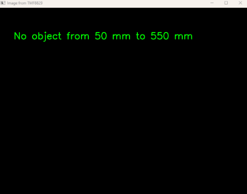
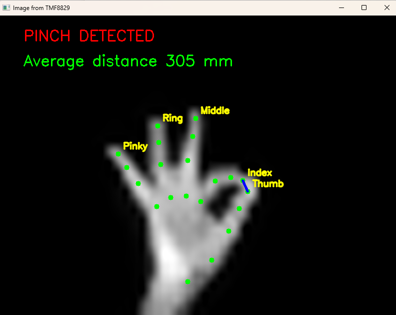

# Hand and pinch detection

Hand detection and pinch detection with TMF8829 dToF sensor in 48x32 mode for a hand in a range up to 500 mm.

This interface operates on
[TMF8829_EVM_DB_DEMO](https://ams-osram.com/products/boards-kits-accessories/kits/ams-tmf8829-evm-db-demo-evaluation-kit)
or [TMF8829_EVM_EB_SHIELD](https://ams-osram.com/products/boards-kits-accessories/kits/ams-tmf8829-evm-eb-shield-evaluation-kit) boards.

Example classification for cup detection, where TMF8829 is located 30 cm above the desk looking downwards:



## Setup

TMF8829 EVM connected to PC - TMF8829_EVM_DB_DEMO or TMF8829_EVM_EB_SHIELD

## Installation

### Virtual environment

Recommendation is to set-up a virtual environment. Open your favourite Windows PowerShell, VisualStudio Code etc.
To install a virtual environment named env, and use it:
```sh
python -m venv env
./env/Scripts/Activate.ps1
```

### Install libraries

Python version 3.13 or higher is required.

To run the scripts in this folder you need to install the packages in the requirements.txt file with:
```bash
pip install -r requirements.txt
```

All required python packages are inside the subdirectory packages.

## Usage

If you are using [TMF8829_EVM_EB_SHIELD](https://ams-osram.com/products/boards-kits-accessories/kits/ams-tmf8829-evm-eb-shield-evaluation-kit), 
start [tmf8829_zeromq_server.py](./tmf8829/zeromq/tmf8829_zeromq_server.py) first; this can be done with 
the pre-compiled server file from [TMF8829_Driver_ZMQ_Server_Client_EXE_\<latest version\>.zip](https://ams-osram.com/tmf8829) or inside a separate shell
```python
python tmf8829/zeromq/tmf8829_zeromq_server.py
```
If you are using [TMF8829_EVM_DB_DEMO](https://ams-osram.com/products/boards-kits-accessories/kits/ams-tmf8829-evm-db-demo-evaluation-kit), 
no additional server needs to be started.

### Execute tool

Run [tmf8829_hand_detection.py](./tmf8829_hand_detection.py)

```python
python tmf8829_hand_detection.py
```
This will open an OpenCV window, where the detection result is displayed:



### Visualization of depth data in parallel

The EVM GUI can be used in parallel to this application, but needs to be started AFTERWARDS.

### Configuration

Update file [cfg_client.json](./tmf8829/zeromq/cfg_client.json) with following examples:
- Parameter **period** [in ms] to modify speed of detection - takes only effect if speed is not defined by iterations.
- Parameter **iterations** [in k iterations] is used to change performance of detection


# Info

This is a fork of [tmf8829_driver_python](https://github.com/ams-OSRAM/tmf8829_driver_python) modifying files to create an application, which can run together with TMF8829_EVM_DB_DEMO or TMF8829_EVM_EB_SHIELD.

As this work relies heavily on OpenCV and MediaPipe, it should run on Windows, Linux or platforms where these libraries are already ported.

# Credits

- **[MediaPipe](https://github.com/google-ai-edge/mediapipe)** - Hand landmark model and MediaPipe (Apache 2.0 license).
- **[OpenCV](https://opencv.org)** - Open Source Computer Vision Library (Apache 2.0 License).